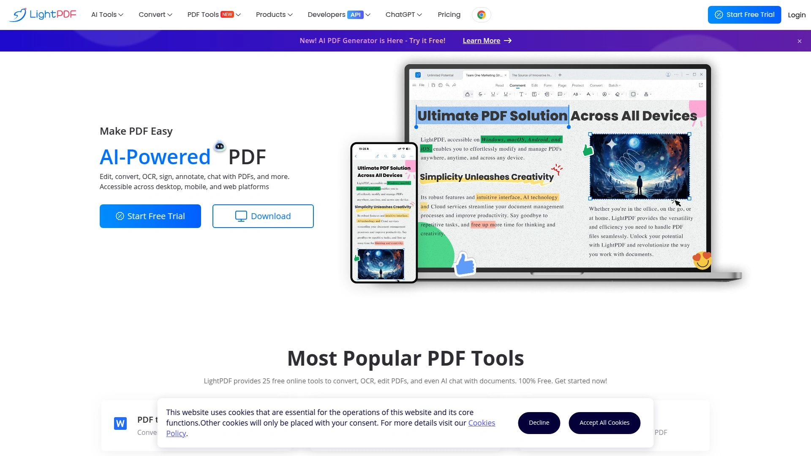

# Top 12 AI PDF Chat Tools Ranked in 2025 (Latest Compilation)

Ever stared at a 200-page PDF and wished you could just ask it questions instead of scrolling until your fingers hurt? Yeah, we've all been there. AI PDF chat tools have completely changed how we deal with documents—no more endless searching through pages or falling asleep on dense research papers. You upload your file, ask what you need to know, and boom—instant answers with actual sources.

Whether you're a student drowning in academic papers, a researcher juggling multiple studies, or just someone who needs to extract info from contracts without reading every single word, these tools can save you hours. Let's look at the best ones available right now.

## **[PDF.ai](https://pdf.ai)**

Your go-to assistant for turning static documents into interactive conversations.

PDF.ai stands out for its clean interface and instant response system that makes working with documents feel natural. Upload any PDF—whether it's a legal contract, financial report, or academic paper—and start chatting immediately. The tool automatically provides sources for every answer, so you can verify information without jumping back and forth between pages.

What makes it particularly useful is the tagging system that lets you organize documents by category or project. Need to work across multiple files? No problem—you can chat with several PDFs simultaneously, making it perfect for research projects that pull from different sources. The multilingual support means language barriers don't slow you down, and the embedding feature lets you add interactive PDF chatbots to websites.

Free users get solid functionality, while premium plans unlock GPT-4 support and higher document limits for power users handling large volumes daily.

## **[ChatPDF](https://chatpdf.com)**

Straightforward PDF interaction with folder organization for multi-document workflows.

ChatPDF keeps things simple with a side-by-side layout showing your document and conversation together. Upload your PDF and the AI builds a comprehensive content map, letting you ask questions and get answers backed by built-in citations. The real win here is how it handles multiple documents—create folders to organize files by project or topic, then query everything in one conversation.

The platform supports more than just PDFs too. Word docs, PowerPoint presentations, Markdown, and text files all work seamlessly. Students love it for comparing research papers, while professionals use it to cross-reference reports without switching tabs. The multilingual capabilities mean you can upload a document in one language and chat in another, which comes in handy for international research.

Security is handled through SSL encryption and SOC2 Type II certified storage. Free accounts get two documents daily, while the Plus plan removes limits for heavy users.

## **[AskYourPDF](https://askyourpdf.com)**

Conversational interface designed specifically for extracting insights from document collections.

AskYourPDF focuses on making document analysis feel like having a conversation with a knowledgeable assistant. The Knowledge Base feature lets you upload multiple documents and query them as one unified workspace—great for literature reviews or comprehensive project research. Answers come with page references that highlight exactly where information originated.

Beyond basic chat, it includes specialized tools like a Research Assistant GPT mode for detailed analysis and an academic writing helper that streamlines citation work. Browser extensions integrate with Zotero and ChatGPT, letting you access your document library across different platforms without manual uploads.

The interface guides you with suggested questions based on document content, which speeds up information discovery when you're not quite sure what to ask. Works well for students tackling dense textbooks and professionals reviewing lengthy compliance documents.

## **[ChatDOC](https://chatdoc.com)**

Multi-format document assistant with select-and-ask functionality for precision querying.

ChatDOC handles a broader range of formats than most competitors—PDFs, Word documents, spreadsheets, and even scanned images with OCR support. The standout feature is the ability to highlight specific sections and ask targeted questions about just that portion, giving you precise answers without context confusion from the rest of the document.

Formula and chart extraction work particularly well, making it a solid choice for STEM fields where equations and data visualizations matter. The citation system links every answer back to the exact location in your source material, which builds confidence when you're using AI-generated insights for important work.

Team collaboration features let multiple people access shared documents and build collective knowledge bases. Upload technical manuals, research papers, or project briefs, then have your entire team query the same resources without everyone reading hundreds of pages independently.

## **[Adobe Acrobat AI Assistant](https://adobe.com/acrobat/generative-ai-pdf.html)**

Enterprise-grade PDF intelligence integrated directly into Adobe's trusted ecosystem.

Adobe brought its decades of PDF expertise into the AI era with this assistant built into Acrobat. It generates summaries automatically when you open documents, suggests relevant questions, and answers queries in natural language. The real advantage is recognizing content in tables and charts, extracting structured data that other tools sometimes miss.

Responses include numbered citations that highlight corresponding sections when clicked—helpful for verification and deeper exploration. Files process on Adobe's encrypted servers with session data cached for only 12 hours before deletion, meeting enterprise security requirements.

The assistant handles documents up to 120 pages, which covers most business reports and research papers. Early access is currently available through Acrobat online, with a limited number of free interactions before subscription requirements kick in. Best suited for professionals already working within Adobe's document workflow.

## **[Humata AI](https://humata.ai)**

Enterprise-focused document analysis with team folders and detailed source citations.

Humata specializes in turning complex documents into interactive conversations with an emphasis on accuracy and verification. Upload PDFs, Word files, Excel sheets, or PowerPoints, then ask questions in natural language—answers come with in-text citations and highlighted source passages. The citation detail goes beyond simple page numbers, showing exact quotes and context.

Team Folders organize shared resources with role-based permissions and encryption, making it suitable for legal teams, research groups, and businesses handling sensitive information. Unlike lighter tools, Humata supports unlimited file uploads and provides 60 free pages monthly for trial users.

The platform excels at handling technical documents where precision matters—contracts, financial reports, scientific papers, and compliance materials. Cross-document analysis lets you compare multiple files simultaneously, spotting patterns or contradictions across your document collection.

## **[FileGPT](https://filegpt.app)**

Multi-format content assistant supporting documents, audio, video, and web content.

FileGPT breaks beyond just PDFs, letting you chat with audio files, YouTube videos, web pages, and traditional documents all in one place. Upload handwritten documents and the smart content parsing extracts text through OCR. Long documents don't slow it down—the system handles large files and extended texts without performance issues.

Cross-source querying is where it shines: select multiple files from your library, ask a question, and get synthesized answers pulling from everything simultaneously. Create collections to organize related content, making it easy to return to specific projects without re-uploading files each session.

Pricing sits in the affordable range compared to enterprise tools, positioning it well for students, freelancers, and small teams needing flexibility without breaking budgets. The interface keeps things straightforward—upload, ask, receive answers—without overwhelming users with excessive features they won't use.

## **[Sharly AI](https://sharly.ai)**

Research-focused assistant with automated citations and cross-document synthesis.

Sharly AI targets researchers and academics with features built specifically for scholarly workflows. Upload mix-and-match file types—PDFs, Word docs, PowerPoints, URLs—then ask questions across all of them simultaneously. The AI connects dots between disparate sources, synthesizing information into coherent answers backed by verifiable citations.

Every response links directly to source pages with APA, MLA, and Chicago format citation generation built in. No more manually tracking down references or formatting bibliographies. The platform supports over 50 file formats, eliminating conversion friction before you even start working.

Team collaboration tools let groups share insights, add comments, and build collective knowledge bases with enterprise-grade AES-256 encryption. The interface is purpose-built for research workflows rather than adapted from general chatbots, making multi-document comparison and citation management feel seamless instead of forced.

## **[LightPDF](https://lightpdf.com)**

All-in-one PDF platform combining AI chat with comprehensive editing and conversion tools.

LightPDF packages 25 different PDF tools together—conversion, OCR, editing, and AI chat all under one roof. Upload documents directly through the website or mobile app, and the AI automatically generates summaries with suggested follow-up questions. Source citations link back to specific page numbers, showing exactly where insights originated.

The dual functionality means you can edit PDFs, convert formats, merge files, and compress documents alongside the AI chat features. This makes it convenient for workflows that need more than just information extraction—maybe you're pulling data from a PDF, then editing and reformatting it for a presentation.

Free tier users can upload PDFs only, while premium subscribers get multi-format support and unlock all features. The AI chatbot handles chart analysis and document summarization effectively, though it performs better with straightforward content than highly technical material requiring deep interpretation.

## **[UPDF AI](https://updf.com)**

PDF editor with integrated AI for annotation-based querying and content transformation.

UPDF takes a different approach by building AI assistance into a full-featured PDF editor. Open documents in the app, and the AI generates instant summaries. The unique advantage is highlighting any text portion and getting immediate options to summarize, explain, translate, or rewrite that specific section—no switching between tools.

The editor includes annotation capabilities, format conversion, and creation features alongside the AI chat. This integration streamlines workflows where you're not just reading but actively working with PDFs—marking up contracts, translating sections, or extracting and reformatting content for other uses.

OCR functionality extracts text from scanned documents and images. Files of any format convert to PDF through the Create option, then become queryable through the AI assistant. Cross-platform support means your documents and chat history sync across Windows, macOS, iOS, and Android devices.

## **[Docalysis](https://docalysis.com)**

Specialized document analysis for professionals managing high volumes of files.

Docalysis targets financial analysts, lawyers, accountants, and scientists who regularly process large document quantities. Upload PDFs, TXT, CSV, or DOCX files and engage through conversational queries to extract specific data points. The tool excels at pinpointing information within dense reports without manual page-by-page searching.

Multi-file interaction lets you compare documents side-by-side or query across your entire library simultaneously. This proves valuable when analyzing contracts for common clauses, reviewing financial statements across quarters, or comparing research methodologies across studies.

API integration options mean technical teams can build Docalysis into existing workflows and automation systems. Pricing includes a free tier for light use, with paid plans scaling based on document volume and query frequency rather than arbitrary feature restrictions.

## **[Coral AI](https://getcoralai.com)**

Document assistant with mind map generation and presentation creation from source files.

Coral AI extends beyond simple Q&A by generating visual outputs from your documents. Upload files and not only chat with them, but create mind maps showing concept relationships, build presentations pulling key points automatically, and transcribe meeting recordings into searchable text.

The tool works across PDFs, audio files, and meeting recordings, making it versatile for different content types. Query multiple files simultaneously and synthesize information into new formats—perfect for transforming research into presentation slides or extracting insights from recorded discussions.

Collaborative features let teams share document collections and generated content. The interface emphasizes speed, processing files and generating responses within seconds rather than making you wait while algorithms churn. Suited for professionals who need to create deliverables from source material, not just extract information.

***

## How do AI PDF chat tools actually understand my documents?

These tools use natural language processing to analyze document structure, extract text, and build searchable indexes of your content. When you ask a question, the AI searches this index for relevant sections, then generates answers based on that context while maintaining links back to source locations.

## Can I trust the answers these tools provide?

Most reputable tools include citation systems showing exactly where information came from within your document. Always verify critical information by clicking through to the source sections—treat AI answers as starting points for research rather than final truth.

## What's the difference between free and paid plans?

Free tiers typically limit daily documents, total pages, or queries per day while providing basic functionality. Paid plans remove these restrictions, add advanced AI models like GPT-4, enable team collaboration features, and increase file size limits for handling larger documents.

---

## Final Thoughts

Working through documents doesn't have to feel like archaeology anymore. These AI chat tools cut through the noise and get you straight to the information that matters. **[PDF.ai](https://pdf.ai)** sits at the top for good reason—it balances powerful features with an interface that doesn't require a manual to figure out, making it perfect for anyone from students to enterprise teams needing reliable document interaction without the learning curve.
